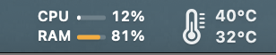
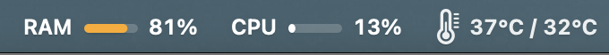
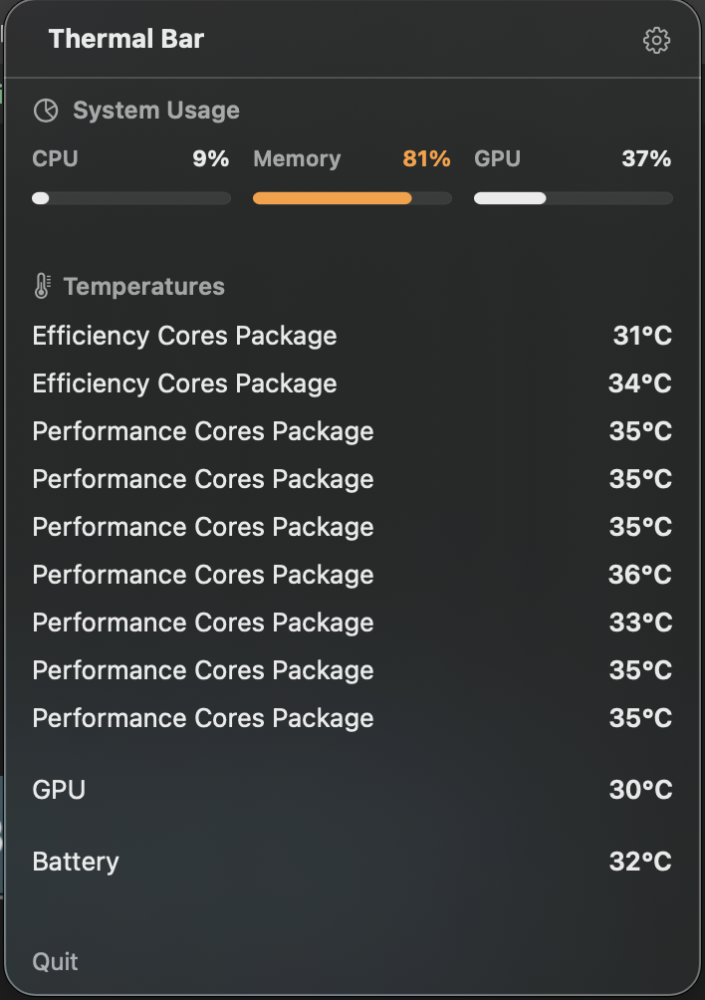
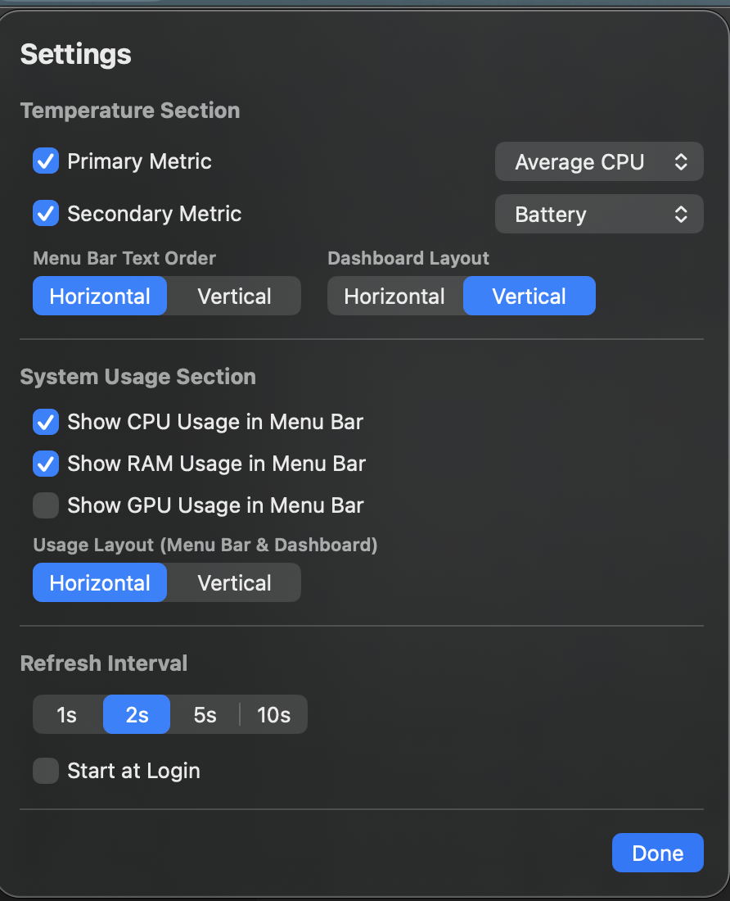

# 🌡️ ThermalBar

**ThermalBar** is an ultra-lightweight, high-precision thermal monitoring utility for macOS. Designed for professionals who need accurate, real-time data on their hardware performance with minimal resource footprint and zero bulk.

## 🖼️ UI Showcase

| Menu Bar (Vertical) | Menu Bar (Horizontal) |
| :---: | :---: |
|  |  |

| Dashboard View | Settings & Customization |
| :---: | :---: |
|  |  |

## ✨ Features

- **Pro-Grade Thermal Accuracy**: Prioritizes raw hardware data from the **AppleSMC** (System Management Controller) for Performance Cores and Battery gas gauges.
- **Real-Time System Usage**: Integrated high-efficiency telemetry tracking for overall CPU load, RAM commitment (memory pressure), and GPU core utilization.
- **Customizable Menu Bar Layouts**:
  - **Vertical View**: A unified, TG Pro-style stacked vertical bar displaying selected metrics (e.g. CPU, RAM, GPU) compactly in one slot.
  - **Horizontal View**: Individual, separated status bar items displaying percentage and mini progress bars side-by-side.
- **Retina-Crisp Rendering**: Custom Core Graphics drawing system using integer-aligned coordinates to ensure pixel-perfect rendering on Retina displays.
- **Intelligent Caching**: Built-in, main-thread-confined `MenuBarImageCache` that reuses `NSImage` instances unless telemetry percentages or system color themes (`isDarkMode`) change, keeping memory consumption extremely low.
- **Multi-Threaded Telemetry**: All hardware queries run continuously on a dedicated background serial queue, dispatching only the final layout state to the main thread asynchronously for 100% stutter-free performance.
- **Apple Silicon Optimized**: Native performance on M1/M2/M3 chips with zero external dependencies and an ultra-lightweight footprint.

## 🛠 Technical Implementation

ThermalBar uses a multi-layered approach to fetch hardware and system telemetry:
1. **AppleSMC (Primary)**: Directly queries SMC hardware registers via IOKit for the most accurate Performance Core and Battery temperatures.
2. **HIDThermal (Secondary)**: Fallback to the macOS HID event system (`IOHIDEventSystemClient`) for supplementary thermal sensor data.
3. **UsageService (System Telemetry)**:
   - **CPU**: Direct Mach kernel processor statistics (`host_processor_info`) with automatic VM deallocation.
   - **RAM**: Mach virtual memory query (`host_statistics64` with `HOST_VM_INFO64`) tracking absolute active and compressed pages against system capacities.
   - **GPU**: Live registration iterator mapping (`IOServiceGetMatchingServices`) querying "PerformanceStatistics" dictionaries via the accelerator subsystem.

## 🚀 Getting Started

### Prerequisites
- macOS 14.0 or later
- Apple Silicon (Recommended) or Intel Mac

### Building from Source
The project is built using a custom Swift-based toolchain (no Xcode required).

```bash
# Build and sign the application
make build

# Launch the app
make run
```

### Installation
Simply drag the generated `ThermalBar.app` to your `/Applications` folder.

## 🔏 Security & Permissions
ThermalBar requires **Code-Signing with Entitlements** to communicate with the `AppleSMC` driver. The included build system automatically applies these entitlements using an ad-hoc signature.

## 🛡️ Privacy & Security

ThermalBar is built with a **Privacy-First** philosophy:
- **Zero Data Collection**: We do not collect, store, or transmit any data. There are no analytics, no tracking, and no "home-calling" features.
- **No Network Access**: ThermalBar does not have network entitlements and cannot connect to the internet.
- **Local Only**: All thermal readings are processed in real-time and stay entirely within your system's memory.
- **Open Source**: The full source code is available for inspection, ensuring transparency in how hardware data is handled.

## ⚖️ License
MIT License. See [LICENSE](LICENSE) for details.
