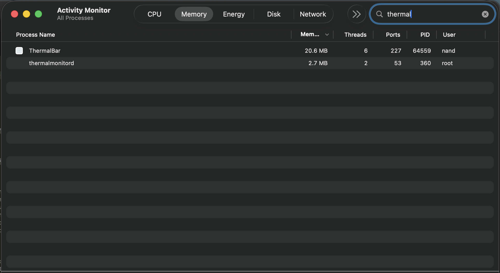

# 🌡️ ThermalBar

**ThermalBar** is an ultra-lightweight, high-precision thermal monitoring utility for macOS. Designed for professionals who need accurate, real-time data on their hardware performance with minimal resource footprint and zero bulk.

## 🖼️ UI Showcase

| Menu Bar (Vertical) | Menu Bar (Horizontal) |
| :---: | :---: |
|  |  |

| Dashboard View | Settings & Customization |
| :---: | :---: |
|  |  |

| Ultra-Low Resource Usage |
| :---: |
|  |

## ✨ Features

- **Pro-Grade Accuracy**: Prioritizes raw hardware data from the **AppleSMC** (System Management Controller) for Performance Cores and Battery gas gauges.
- **Pixel-Perfect Menu Bar**: A compact, vertical 2-line display inspired by the best professional monitoring tools (TG Pro style).
- **Retina-Crisp Rendering**: Custom NSImage rendering engine using integer-aligned coordinates to ensure maximum sharpness on Retina displays.
- **Detailed Dashboard**: View every individual CPU package sensor, GPU temperatures, and unified battery data in a clean, progress-bar-free interface.
- **Intelligent Alerts**: Real-time notifications for high-temperature thresholds and thermal throttling states.
- **Ultra-Lightweight**: Built natively in Swift with zero external dependencies, consuming minimal CPU and RAM (under 20MB in typical use).
- **Apple Silicon Optimized**: Native performance on M1/M2/M3 chips with zero overhead.

## 🛠 Technical Implementation

ThermalBar uses a multi-layered approach to fetch thermal data:
1. **AppleSMC (Primary)**: Directly queries hardware keys via IOKit for the most accurate Performance Core and Battery temperatures.
2. **HIDThermal (Secondary)**: Fallback to the macOS HID event system for supplementary sensor data.
3. **IOBattery (Unified)**: Integrated battery health and state monitoring.

## 🚀 Getting Started

### Prerequisites
- macOS 14.0 or later
- Apple Silicon (Recommended) or Intel Mac

### Building from Source
The project is built using a custom Swift-based toolchain (no Xcode required).

```bash
# Build and sign the application
make build

# Launch the app
make run
```

### Installation
Simply drag the generated `ThermalBar.app` to your `/Applications` folder.

## 🔏 Security & Permissions
ThermalBar requires **Code-Signing with Entitlements** to communicate with the `AppleSMC` driver. The included build system automatically applies these entitlements using an ad-hoc signature.

## 🛡️ Privacy & Security

ThermalBar is built with a **Privacy-First** philosophy:
- **Zero Data Collection**: We do not collect, store, or transmit any data. There are no analytics, no tracking, and no "home-calling" features.
- **No Network Access**: ThermalBar does not have network entitlements and cannot connect to the internet.
- **Local Only**: All thermal readings are processed in real-time and stay entirely within your system's memory.
- **Open Source**: The full source code is available for inspection, ensuring transparency in how hardware data is handled.

## ⚖️ License
MIT License. See [LICENSE](LICENSE) for details.
